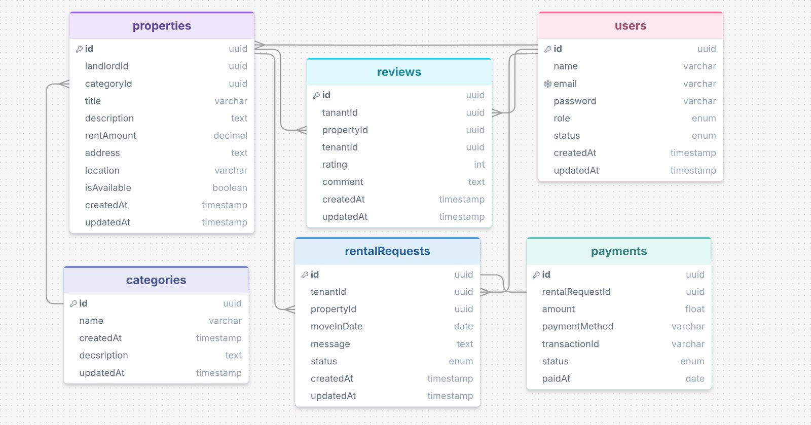

# RentNest

# 🛠 Tech Stack


---

## 📖 Project Description

**RentNest API** is a RESTful backend application built with **Express.js**, **TypeScript**, **Prisma ORM**, and **PostgreSQL**. It provides secure authentication, property management, rental requests, Stripe payment integration, reviews, and role-based access control for tenants, landlords, and administrators.


# 🚀 Deployment

The project is deployed on **Vercel**.

## 🚀 Live API

### Base URL

```text
https://rent-nest-chi.vercel.app/
```

> **Note:** This project is tested using the provided Postman Collection.

---


# 🗄️ Entity Relationship Diagram (ERD)

The database schema for Rental Marketplace API is illustrated below.




---

# ⚙️ Installation

## Clone the repository

```bash
git clone https://github.com/Zobaida-Jim/Rental-Marketplace-API
```

## Navigate to the project directory

```bash
cd Rental-Marketplace-API
```

## Install dependencies

```bash
npm install
```

## Generate Prisma Client

```bash
npx prisma generate
```

## Run Database Migration

```bash
npx prisma migrate dev
```

## Start Development Server

```bash
npm run dev
```

## Build Project

```bash
npm run build
```

---

## 🔐 Environment Variables

Copy **`.env.example`** to **`.env`** and update the required values.

```bash
cp .env.example .env
```

---


# 📂 Project Structure

```text
Rental_Marketplace_API/
├── prisma/
│   ├── migrations/
│   └── schema/
│       ├── category.prisma
│       ├── enum.prisma
│       ├── payment.prisma
│       ├── property.prisma
│       ├── rentalRequest.prisma
│       ├── review.prisma
│       ├── schema.prisma
│       └── user.prisma
│
├── src/
│   ├── config/
│   │   └── index.ts
│   │
│   ├── lib/
│   │   ├── prisma.ts
│   │   └── stripe.ts
│   │
│   ├── middleware/
│   │   ├── auth.ts
│   │   ├── globalErrorHandler.ts
│   │   └── notFoundRoute.ts
│   │
│   ├── modules/
│   │   ├── admin/
│   │   ├── landlordManagement/
│   │   ├── payments/
│   │   ├── property/
│   │   ├── rentalRequest/
│   │   ├── review/
│   │   └── user/
│   │
│   ├── utils/
│   │   ├── blockedStatus.ts
│   │   ├── catchAsync.ts
│   │   ├── jwt.ts
│   │   └── sendResponse.ts
│   │
│   ├── app.ts
│   └── server.ts
│
├── .env
├── package.json
├── package-lock.json
├── prisma.config.ts
├── tsconfig.json
├── tsup.config.ts
├── vercel.json
└── README.md
```

---